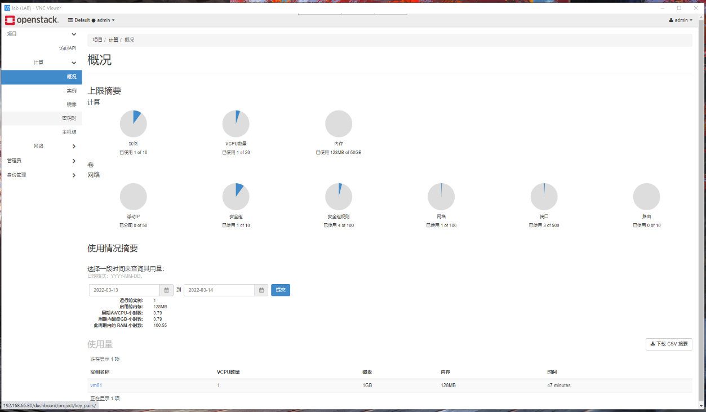

# 0思路的构建&实验室准备&网络规划


**实验室宿主设备配置：**

**宿主机A硬件配置： i5-4200H 4代U 主频2.8GHz 睿频 3.4GHz / 16GB /** **Lenove 256GB SDD** **/ 百兆USB 网卡（11MB/S VM10网络桥接自定义）**

**宿主机B硬件配置： i7-11800H 11代U 主频2.3GHz 睿频 4.6GHz / 16GB / SAMSUNG 512GB NVMe PCIE4.0\*4高速 SSD / 百兆USB 网卡（11MB/S VM10网络桥接自定义）**

| **主机名** | **用途**                    | **磁盘/大小**                          | **所在宿主机** | **操作系统** | **内存规划（超额）** | **swap分区（磁盘当作硬盘）** | **公共网络（用于yum源以及网络连接）ens33** | **集群网络（用于存储和计算集群互联）ens37** | **租户网络（用于客户端访问）** **内部通信 ens38** | **备注**                        |
| ---------- | --------------------------- | -------------------------------------- | -------------- | ------------ | -------------------- | ---------------------------- | ------------------------------------------ | ------------------------------------------- | ------------------------------------------------- | ------------------------------- |
| template   | 虚拟机模板                  | sda/300G                               | 宿主机B        | Centos7.9    | 8GB                  | 8GB 超额OOM                  | 192.168.66.78/24                           |                                             |                                                   |                                 |
| yum01      | 本地YUM源仓库（全部Last）   | sda/300G                               | 宿主机A        | Centos7.9    | 2GB/1G               | 8GB 超额OOM                  | 192.168.66.79/24                           | 192.168.30.50/get 30.2                      |                                                   | NAT 为外网映射用于获取离线YUM。 |
| controller | openstack控制节点           | sda/300G                               | 宿主机B        | Centos7.9    | 8GB/4G               | 8GB 超额OOM                  | 192.168.66.80/24                           | 10.10.10.80/24                              | 20.198.52.10/24                                   |                                 |
| compute01  | openstack计算节点、存储节点 | sda/300G、sdb/50G                      | 宿主机B        | Centos7.9    | 6GB/4G               | 8GB 超额OOM                  | 192.168.66.81/24                           | 10.10.10.81/24                              | 20.198.52.11/24                                   |                                 |
| compute02  | openstack计算节点、存储节点 | sda/300G、sdb/50G                      | 宿主机B        | Centos7.9    | 6GB/4G               | 8GB 超额OOM                  | 192.168.66.82/24                           | 10.10.10.82/24                              | 20.198.52.12/24                                   |                                 |
| ceph01     | ceph存储节点                | sda/300G、sdb/100G、sdc/100G、sdd/100G | 宿主机A        | Centos7.9    | 4GB/2G               | 8GB 超额OOM                  | 192.168.66.83/24                           | 10.10.10.83/24                              |                                                   |                                 |
| ceph02     | ceph存储节点                | sda/300G、sdb/100G、sdc/100G、sdd/100G | 宿主机A        | Centos7.9    | 4GB/2G               | 8GB 超额OOM                  | 192.168.66.84/24                           | 10.10.10.84/24                              |                                                   |                                 |
| ceph03     | ceph存储节点                | sda/300G、sdb/100G、sdc/100G、sdd/100G | 宿主机A        | Centos7.9    | 4GB/2G               | 8GB 超额OOM                  | 192.168.66.85/24                           | 10.10.10.85/24                              |                                                   |                                 |

**底层网络测试**

**宿主机器A 联想拯救者** ***10段的网络需要把子网掩码改成24,并禁用网卡节能**


**联调测试**


**宿主机器B HP暗影精灵** ***10段的网络需要把子网掩码改成24,并禁用网卡节能**


**联调测试**


**根据教程弄虚拟机的模板 然后关机 克隆 克隆给yum01**

**这里yum01 应该分配宿主机器A 但是由于网络方便的情况 这部分采用宿主机器B来进行下载 磁盘IO 比较高**

**添加一块net的网卡用于互联网通信  静态网卡要设置好。**

**构建内网的repo**

```powershell
Private.repo

[base]

name=CentOS-$releasever - Base

baseurl=http://yum01/yumrepos/base/

gpgcheck=0

enabled=1

[epel]

name=CentOS-$releasever - epel

baseurl=http://yum01/yumrepos/epel/

gpgcheck=0

enabled=1

[docker-ce-stable]

name=CentOS-$releasever - docker-ce-stable

baseurl=http://yum01/yumrepos/docker-ce-stable/

gpgcheck=0

enabled=1

[updates]

name=CentOS-$releasever - Updates

baseurl=http://yum01/yumrepos/updates/

gpgcheck=0

enabled=1

[extras]

name=CentOS-$releasever - Extras

baseurl=http://yum01/yumrepos/extras/

gpgcheck=0

enabled=1

[centos-openstack-train]

name=CentOS-7 - OpenStack train

baseurl=http://yum01/yumrepos/centos-openstack-train/

gpgcheck=0

enabled=1

[centos-qemu-ev]

name=CentOS-$releasever - QEMU EV

baseurl=http://yum01/yumrepos/centos-qemu-ev/

gpgcheck=0

enabled=1

[ceph]

name=ceph-Nautilus

baseurl=http://yum01/yumrepos/ceph/

gpgcheck=0

enabled=1

[ceph-noarch]

name=ceph-noarch Nautilus

baseurl=http://yum01/yumrepos/ceph-noarch/

gpgcheck=0

enabled=1

[centos-nfs-ganesha28]

name=CentOS-7 - NFS Ganesha 2.8

baseurl=http://yum01/yumrepos/centos-nfs-ganesha28/

gpgcheck=0{"name":"insertLink","args":{"src":"note:\/\/WEBd3c4e51825b2b99054af0fa37244e83b","text":"0思路的构建&实验室准备&网络规划.note"}}

enabled=1

[openresty]

name=Official OpenResty Open Source Repository for CentOS

baseurl=http://yum01/yumrepos/openresty/

skip_if_unavailable=False

gpgcheck=0

repo_gpgcheck=0

gpgkey=file:///etc/yum.repos.d/pubkey.gpg

enabled=1

enabled_metadata=1


zabbix ok

python-dns-1.15.0-5.el7 一个包冲突
Error: Package: 2:librados2-14.2.22-0.el7.x86_64 (ceph)
           Requires: liblttng-ust.so.0()(64bit)
Error: Package: 2:librbd1-14.2.22-0.el7.x86_64 (ceph)
           Requires: liblttng-ust.so.0()(64bit)
Error: Package: python-dns-1.15.0-5.el7.noarch (centos-openstack-train)
           Requires: python-crypto
           
 解决方案：
   82  yum remove libvirt-libs
   83  yum update
   84  yum remove python-dns
   85  yum update
   86  yum remove librados2
   87  yum update
   88  history
                                     

更新结果
Installed:
  kernel.x86_64 0:3.10.0-1160.53.1.el7      kernel-devel.x86_64 0:3.10.0-1160.53.1.el7 
  python2-backports.x86_64 0:1.0-16.el7     python2-cffi.x86_64 0:1.11.2-1.el7         
  python2-chardet.noarch 0:3.0.4-7.el7      python2-coverage.x86_64 0:4.4.1-1.el7      
  python2-dateutil.noarch 1:2.8.0-1.el7     python2-idna.noarch 0:2.5-1.el7            
  python2-ipaddress.noarch 0:1.0.18-5.el7   python2-ldap.x86_64 0:3.1.0-1.el7          
  python2-markupsafe.x86_64 0:1.1.0-2.el7   python2-netaddr.noarch 0:0.7.19-5.el7      
  python2-pyOpenSSL.noarch 0:19.0.0-1.el7   python2-pyparsing.noarch 0:2.3.1-1.el7     
  python2-pyudev.noarch 0:0.18.1-6.el7      python2-requests.noarch 0:2.21.0-3.el7     
  python2-setuptools.noarch 0:40.8.0-1.el7  python2-six.noarch 0:1.12.0-1.el7          
  python2-urllib3.noarch 0:1.24.1-3.el7     sip-macros.noarch 0:4.19-1.el7             

Dependency Installed:
  mariadb-common.x86_64 3:10.3.20-3.el7.0.0.rdo1                                       
  mariadb-config.x86_64 3:10.3.20-3.el7.0.0.rdo1                                       
  python2-asn1crypto.noarch 0:0.23.0-2.el7                                             
  python2-pysocks.noarch 0:1.5.6-3.el7                                                 

Updated:
  NetworkManager.x86_64 1:1.18.8-2.el7_9                                               
  NetworkManager-adsl.x86_64 1:1.18.8-2.el7_9                                          
  NetworkManager-glib.x86_64 1:1.18.8-2.el7_9                                          
  NetworkManager-libnm.x86_64 1:1.18.8-2.el7_9                                         
  NetworkManager-ppp.x86_64 1:1.18.8-2.el7_9                                           
  NetworkManager-team.x86_64 1:1.18.8-2.el7_9                                          
  NetworkManager-tui.x86_64 1:1.18.8-2.el7_9                                           
  NetworkManager-wifi.x86_64 1:1.18.8-2.el7_9                                          
  adcli.x86_64 0:0.8.1-16.el7_9.1                                                      
  autofs.x86_64 1:5.0.7-116.el7_9                                                      
  bash.x86_64 0:4.2.46-35.el7_9                                                        
  bind-export-libs.x86_64 32:9.11.4-26.P2.el7_9.8                                      
  bind-libs.x86_64 32:9.11.4-26.P2.el7_9.8                                             
  bind-libs-lite.x86_64 32:9.11.4-26.P2.el7_9.8                                        
  bind-license.noarch 32:9.11.4-26.P2.el7_9.8                                          
  bind-utils.x86_64 32:9.11.4-26.P2.el7_9.8                                            
  binutils.x86_64 0:2.27-44.base.el7_9.1                                               
  binutils-devel.x86_64 0:2.27-44.base.el7_9.1                                         
  bpftool.x86_64 0:3.10.0-1160.53.1.el7                                                
  ca-certificates.noarch 0:2021.2.50-72.el7_9                                          
  centos-release.x86_64 0:7-9.2009.1.el7.centos                                        
  certmonger.x86_64 0:0.78.4-17.el7_9                                                  
  control-center.x86_64 1:3.28.1-8.el7_9                                               
  control-center-filesystem.x86_64 1:3.28.1-8.el7_9                                    
  coreutils.x86_64 0:8.22-24.el7_9.2                                                   
  crash.x86_64 0:7.2.3-11.el7_9.1                                                      
  cronie.x86_64 0:1.4.11-24.el7_9                                                      
  cronie-anacron.x86_64 0:1.4.11-24.el7_9                                              
  curl.x86_64 0:7.29.0-59.el7_9.1                                                      
  device-mapper.x86_64 7:1.02.170-6.el7_9.5                                            
  device-mapper-event.x86_64 7:1.02.170-6.el7_9.5                                      
  device-mapper-event-libs.x86_64 7:1.02.170-6.el7_9.5                                 
  device-mapper-libs.x86_64 7:1.02.170-6.el7_9.5                                       
  device-mapper-multipath.x86_64 0:0.4.9-135.el7_9                                     
  device-mapper-multipath-libs.x86_64 0:0.4.9-135.el7_9                                
  device-mapper-persistent-data.x86_64 0:0.8.5-3.el7_9.2                               
  dhclient.x86_64 12:4.2.5-83.el7.centos.1                                             
  dhcp-common.x86_64 12:4.2.5-83.el7.centos.1                                          
  dhcp-libs.x86_64 12:4.2.5-83.el7.centos.1                                            
  dmidecode.x86_64 1:3.2-5.el7_9.1                                                     
  dnsmasq.x86_64 0:2.76-17.el7_9.3                                                     
  evolution-ews.x86_64 0:3.28.5-8.el7_9                                                
  evolution-ews-langpacks.noarch 0:3.28.5-8.el7_9                                      
  firefox.x86_64 0:91.5.0-1.el7.centos                                                 
  firewall-config.noarch 0:0.6.3-13.el7_9                                              
  firewalld.noarch 0:0.6.3-13.el7_9                                                    
  firewalld-filesystem.noarch 0:0.6.3-13.el7_9                                         
  flatpak.x86_64 0:1.0.9-12.el7_9                                                      
  flatpak-libs.x86_64 0:1.0.9-12.el7_9                                                 
  foomatic-filters.x86_64 0:4.0.9-10.el7_9                                             
  freerdp.x86_64 0:2.1.1-5.el7_9                                                       
  freerdp-libs.x86_64 0:2.1.1-5.el7_9                                                  
  freetype.x86_64 0:2.8-14.el7_9.1                                                     
  freetype-devel.x86_64 0:2.8-14.el7_9.1                                               
  gd.x86_64 0:2.0.35-27.el7_9                                                          
  gdm.x86_64 1:3.28.2-26.el7                                                           
  glib2.x86_64 0:2.56.1-9.el7_9                                                        
  glib2-devel.x86_64 0:2.56.1-9.el7_9                                                  
  glibc.x86_64 0:2.17-325.el7_9                                                        
  glibc-common.x86_64 0:2.17-325.el7_9                                                 
  glibc-devel.x86_64 0:2.17-325.el7_9                                                  
  glibc-headers.x86_64 0:2.17-325.el7_9                                                
  glusterfs.x86_64 0:6.0-49.1.el7                                                      
  glusterfs-api.x86_64 0:6.0-49.1.el7                                                  
  glusterfs-cli.x86_64 0:6.0-49.1.el7                                                  
  glusterfs-client-xlators.x86_64 0:6.0-49.1.el7                                       
  glusterfs-fuse.x86_64 0:6.0-49.1.el7                                                 
  glusterfs-libs.x86_64 0:6.0-49.1.el7                                                 
  gnome-classic-session.noarch 0:3.28.1-17.el7_9                                       
  gnome-settings-daemon.x86_64 0:3.28.1-11.el7_9                                       
  gnome-shell.x86_64 0:3.28.3-34.el7_9                                                 
  gnome-shell-extension-alternate-tab.noarch 0:3.28.1-17.el7_9                         
  gnome-shell-extension-apps-menu.noarch 0:3.28.1-17.el7_9                             
  gnome-shell-extension-common.noarch 0:3.28.1-17.el7_9                                
  gnome-shell-extension-horizontal-workspaces.noarch 0:3.28.1-17.el7_9                 
  gnome-shell-extension-launch-new-instance.noarch 0:3.28.1-17.el7_9                   
  gnome-shell-extension-places-menu.noarch 0:3.28.1-17.el7_9                           
  gnome-shell-extension-top-icons.noarch 0:3.28.1-17.el7_9                             
  gnome-shell-extension-user-theme.noarch 0:3.28.1-17.el7_9                            
  gnome-shell-extension-window-list.noarch 0:3.28.1-17.el7_9                           
  grub2.x86_64 1:2.02-0.87.el7.centos.7                                                
  grub2-common.noarch 1:2.02-0.87.el7.centos.7                                         
  grub2-pc.x86_64 1:2.02-0.87.el7.centos.7                                             
  grub2-pc-modules.noarch 1:2.02-0.87.el7.centos.7                                     
  grub2-tools.x86_64 1:2.02-0.87.el7.centos.7                                          
  grub2-tools-extra.x86_64 1:2.02-0.87.el7.centos.7                                    
  grub2-tools-minimal.x86_64 1:2.02-0.87.el7.centos.7                                  
  gssproxy.x86_64 0:0.7.0-30.el7_9                                                     
  gtk-update-icon-cache.x86_64 0:3.22.30-6.el7                                         
  gtk3.x86_64 0:3.22.30-6.el7                                                          
  gtk3-devel.x86_64 0:3.22.30-6.el7                                                    
  gtk3-immodule-xim.x86_64 0:3.22.30-6.el7                                             
  gupnp.x86_64 0:1.0.2-6.el7_9                                                         
  gvfs.x86_64 0:1.36.2-5.el7_9                                                         
  gvfs-afc.x86_64 0:1.36.2-5.el7_9                                                     
  gvfs-afp.x86_64 0:1.36.2-5.el7_9                                                     
  gvfs-archive.x86_64 0:1.36.2-5.el7_9                                                 
  gvfs-client.x86_64 0:1.36.2-5.el7_9                                                  
  gvfs-devel.x86_64 0:1.36.2-5.el7_9                                                   
  gvfs-fuse.x86_64 0:1.36.2-5.el7_9                                                    
  gvfs-goa.x86_64 0:1.36.2-5.el7_9                                                     
  gvfs-gphoto2.x86_64 0:1.36.2-5.el7_9                                                 
  gvfs-mtp.x86_64 0:1.36.2-5.el7_9                                                     
  gvfs-smb.x86_64 0:1.36.2-5.el7_9                                                     
  hivex.x86_64 0:1.3.10-6.12.el7_9                                                     
  httpd.x86_64 0:2.4.6-97.el7.centos.4                                                 
  httpd-devel.x86_64 0:2.4.6-97.el7.centos.4                                           
  httpd-manual.noarch 0:2.4.6-97.el7.centos.4                                          
  httpd-tools.x86_64 0:2.4.6-97.el7.centos.4                                           
  ibacm.x86_64 0:22.4-6.el7_9                                                          
  ibus.x86_64 0:1.5.17-12.el7_9                                                        
  ibus-gtk2.x86_64 0:1.5.17-12.el7_9                                                   
  ibus-gtk3.x86_64 0:1.5.17-12.el7_9                                                   
  ibus-libs.x86_64 0:1.5.17-12.el7_9                                                   
  ibus-setup.noarch 0:1.5.17-12.el7_9                                                  
  icedtea-web.x86_64 0:1.7.1-4.el7_9                                                   
  initscripts.x86_64 0:9.49.53-1.el7_9.1                                               
  ipa-client-common.noarch 0:4.6.8-5.el7.centos.10                                     
  ipa-common.noarch 0:4.6.8-5.el7.centos.10                                            
  iprutils.x86_64 0:2.4.17.1-3.el7_7                                                   
  iscsi-initiator-utils.x86_64 0:6.2.0.874-22.el7_9                                    
  iscsi-initiator-utils-iscsiuio.x86_64 0:6.2.0.874-22.el7_9                           
  iwl100-firmware.noarch 0:39.31.5.1-80.el7_9                                          
  iwl1000-firmware.noarch 1:39.31.5.1-80.el7_9                                         
  iwl105-firmware.noarch 0:18.168.6.1-80.el7_9                                         
  iwl135-firmware.noarch 0:18.168.6.1-80.el7_9                                         
  iwl2000-firmware.noarch 0:18.168.6.1-80.el7_9                                        
  iwl2030-firmware.noarch 0:18.168.6.1-80.el7_9                                        
  iwl3160-firmware.noarch 0:25.30.13.0-80.el7_9                                        
  iwl3945-firmware.noarch 0:15.32.2.9-80.el7_9                                         
  iwl4965-firmware.noarch 0:228.61.2.24-80.el7_9                                       
  iwl5000-firmware.noarch 0:8.83.5.1_1-80.el7_9                                        
  iwl5150-firmware.noarch 0:8.24.2.2-80.el7_9                                          
  iwl6000-firmware.noarch 0:9.221.4.1-80.el7_9                                         
  iwl6000g2a-firmware.noarch 0:18.168.6.1-80.el7_9                                     
  iwl6000g2b-firmware.noarch 0:18.168.6.1-80.el7_9                                     
  iwl6050-firmware.noarch 0:41.28.5.1-80.el7_9                                         
  iwl7260-firmware.noarch 0:25.30.13.0-80.el7_9                                        
  java-1.8.0-openjdk.x86_64 1:1.8.0.322.b06-1.el7_9                                    
  java-1.8.0-openjdk-devel.x86_64 1:1.8.0.322.b06-1.el7_9                              
  java-1.8.0-openjdk-headless.x86_64 1:1.8.0.322.b06-1.el7_9                           
  kbd.x86_64 0:1.15.5-16.el7_9                                                         
  kbd-legacy.noarch 0:1.15.5-16.el7_9                                                  
  kbd-misc.noarch 0:1.15.5-16.el7_9                                                    
  kde-style-oxygen.x86_64 0:4.11.19-16.el7_9                                           
  kde-workspace-devel.x86_64 0:4.11.19-16.el7_9                                        
  kde-workspace-libs.x86_64 0:4.11.19-16.el7_9                                         
  kernel-headers.x86_64 0:3.10.0-1160.53.1.el7                                         
  kernel-tools.x86_64 0:3.10.0-1160.53.1.el7                                           
  kernel-tools-libs.x86_64 0:3.10.0-1160.53.1.el7                                      
  kexec-tools.x86_64 0:2.0.15-51.el7_9.3                                               
  kpartx.x86_64 0:0.4.9-135.el7_9                                                      
  krb5-devel.x86_64 0:1.15.1-51.el7_9                                                  
  krb5-libs.x86_64 0:1.15.1-51.el7_9                                                   
  krb5-workstation.x86_64 0:1.15.1-51.el7_9                                            
  ksysguard-libs.x86_64 0:4.11.19-16.el7_9                                             
  kwin-gles-libs.x86_64 0:4.11.19-16.el7_9                                             
  kwin-libs.x86_64 0:4.11.19-16.el7_9                                                  
  libX11.x86_64 0:1.6.7-4.el7_9                                                        
  libX11-common.noarch 0:1.6.7-4.el7_9                                                 
  libX11-devel.x86_64 0:1.6.7-4.el7_9                                                  
  libblkid.x86_64 0:2.23.2-65.el7_9.1                                                  
  libblkid-devel.x86_64 0:2.23.2-65.el7_9.1                                            
  libcroco.x86_64 0:0.6.12-6.el7_9                                                     
  libcurl.x86_64 0:7.29.0-59.el7_9.1                                                   
  libcurl-devel.x86_64 0:7.29.0-59.el7_9.1                                             
  libexif.x86_64 0:0.6.22-2.el7_9                                                      
  libgudev1.x86_64 0:219-78.el7_9.5                                                    
  libgudev1-devel.x86_64 0:219-78.el7_9.5                                              
  libgweather.x86_64 0:3.28.2-4.el7_9                                                  
  libgweather-devel.x86_64 0:3.28.2-4.el7_9                                            
  libibumad.x86_64 0:22.4-6.el7_9                                                      
  libibverbs.x86_64 0:22.4-6.el7_9                                                     
  libipa_hbac.x86_64 0:1.16.5-10.el7_9.11                                              
  libkadm5.x86_64 0:1.15.1-51.el7_9                                                    
  libkworkspace.x86_64 0:4.11.19-16.el7_9                                              
  libldb.x86_64 0:1.5.4-2.el7                                                          
  libmount.x86_64 0:2.23.2-65.el7_9.1                                                  
  librdmacm.x86_64 0:22.4-6.el7_9                                                      
  libreswan.x86_64 0:3.25-9.1.el7_8                                                    
  libseccomp.x86_64 0:2.4.1-0.el7                                                      
  libsmartcols.x86_64 0:2.23.2-65.el7_9.1                                              
  libsmbclient.x86_64 0:4.10.16-18.el7_9                                               
  libsndfile.x86_64 0:1.0.25-12.el7_9.1                                                
  libsss_autofs.x86_64 0:1.16.5-10.el7_9.11                                            
  libsss_certmap.x86_64 0:1.16.5-10.el7_9.11                                           
  libsss_idmap.x86_64 0:1.16.5-10.el7_9.11                                             
  libsss_nss_idmap.x86_64 0:1.16.5-10.el7_9.11                                         
  libsss_sudo.x86_64 0:1.16.5-10.el7_9.11                                              
  libstoragemgmt.x86_64 0:1.8.1-2.el7_9                                                
  libstoragemgmt-python.noarch 0:1.8.1-2.el7_9                                         
  libstoragemgmt-python-clibs.x86_64 0:1.8.1-2.el7_9                                   
  libuuid.x86_64 0:2.23.2-65.el7_9.1                                                   
  libuuid-devel.x86_64 0:2.23.2-65.el7_9.1                                             
  libvirt-bash-completion.x86_64 0:4.5.0-36.el7_9.5                                    
  libvncserver.x86_64 0:0.9.9-14.el7_8.1                                               
  libwbclient.x86_64 0:4.10.16-18.el7_9                                                
  libwebp.x86_64 0:0.3.0-10.el7_9                                                      
  libwinpr.x86_64 0:2.1.1-5.el7_9                                                      
  libxml2.x86_64 0:2.9.1-6.el7_9.6                                                     
  libxml2-devel.x86_64 0:2.9.1-6.el7_9.6                                               
  libxml2-python.x86_64 0:2.9.1-6.el7_9.6                                              
  linux-firmware.noarch 0:20200421-80.git78c0348.el7_9                                 
  log4j.noarch 0:1.2.17-18.el7_4                                                       
  lvm2.x86_64 7:2.02.187-6.el7_9.5                                                     
  lvm2-libs.x86_64 7:2.02.187-6.el7_9.5                                                
  mariadb-devel.x86_64 3:10.3.20-3.el7.0.0.rdo1                                        
  mariadb-libs.x86_64 3:10.3.20-3.el7.0.0.rdo1                                         
  mdadm.x86_64 0:4.1-8.el7_9                                                           
  mesa-dri-drivers.x86_64 0:18.3.4-12.el7_9                                            
  mesa-filesystem.x86_64 0:18.3.4-12.el7_9                                             
  mesa-khr-devel.x86_64 0:18.3.4-12.el7_9                                              
  mesa-libEGL.x86_64 0:18.3.4-12.el7_9                                                 
  mesa-libEGL-devel.x86_64 0:18.3.4-12.el7_9                                           
  mesa-libGL.x86_64 0:18.3.4-12.el7_9                                                  
  mesa-libGL-devel.x86_64 0:18.3.4-12.el7_9                                            
  mesa-libgbm.x86_64 0:18.3.4-12.el7_9                                                 
  mesa-libglapi.x86_64 0:18.3.4-12.el7_9                                               
  mesa-libxatracker.x86_64 0:18.3.4-12.el7_9                                           
  microcode_ctl.x86_64 2:2.1-73.11.el7_9                                               
  mod_ssl.x86_64 1:2.4.6-97.el7.centos.4                                               
  mutter.x86_64 0:3.28.3-30.el7                                                        
  net-snmp.x86_64 1:5.7.2-49.el7_9.1                                                   
  net-snmp-agent-libs.x86_64 1:5.7.2-49.el7_9.1                                        
  net-snmp-devel.x86_64 1:5.7.2-49.el7_9.1                                             
  net-snmp-libs.x86_64 1:5.7.2-49.el7_9.1                                              
  nettle.x86_64 0:2.7.1-9.el7_9                                                        
  nettle-devel.x86_64 0:2.7.1-9.el7_9                                                  
  nfs-utils.x86_64 1:1.3.0-0.68.el7.2                                                  
  nspr.x86_64 0:4.32.0-1.el7_9                                                         
  nspr-devel.x86_64 0:4.32.0-1.el7_9                                                   
  nss.x86_64 0:3.67.0-4.el7_9                                                          
  nss-devel.x86_64 0:3.67.0-4.el7_9                                                    
  nss-softokn.x86_64 0:3.67.0-3.el7_9                                                  
  nss-softokn-devel.x86_64 0:3.67.0-3.el7_9                                            
  nss-softokn-freebl.x86_64 0:3.67.0-3.el7_9                                           
  nss-softokn-freebl-devel.x86_64 0:3.67.0-3.el7_9                                     
  nss-sysinit.x86_64 0:3.67.0-4.el7_9                                                  
  nss-tools.x86_64 0:3.67.0-4.el7_9                                                    
  nss-util.x86_64 0:3.67.0-1.el7_9                                                     
  nss-util-devel.x86_64 0:3.67.0-1.el7_9                                               
  open-vm-tools.x86_64 0:11.0.5-3.el7_9.3                                              
  open-vm-tools-desktop.x86_64 0:11.0.5-3.el7_9.3                                      
  openldap.x86_64 0:2.4.44-24.el7_9                                                    
  openldap-devel.x86_64 0:2.4.44-24.el7_9                                              
  openssh.x86_64 0:7.4p1-22.el7_9                                                      
  openssh-clients.x86_64 0:7.4p1-22.el7_9                                              
  openssh-server.x86_64 0:7.4p1-22.el7_9                                               
  openssl.x86_64 1:1.0.2k-24.el7_9                                                     
  openssl-devel.x86_64 1:1.0.2k-24.el7_9                                               
  openssl-libs.x86_64 1:1.0.2k-24.el7_9                                                
  patchutils.x86_64 0:0.3.3-5.el7_9                                                    
  pcp.x86_64 0:4.3.2-13.el7_9                                                          
  pcp-conf.x86_64 0:4.3.2-13.el7_9                                                     
  pcp-libs.x86_64 0:4.3.2-13.el7_9                                                     
  pcp-selinux.x86_64 0:4.3.2-13.el7_9                                                  
  perf.x86_64 0:3.10.0-1160.53.1.el7                                                   
  perl.x86_64 4:5.16.3-299.el7_9                                                       
  perl-CPAN.noarch 0:1.9800-299.el7_9                                                  
  perl-ExtUtils-CBuilder.noarch 1:0.28.2.6-299.el7_9                                   
  perl-ExtUtils-Embed.noarch 0:1.30-299.el7_9                                          
  perl-ExtUtils-Install.noarch 0:1.58-299.el7_9                                        
  perl-IO-Zlib.noarch 1:1.10-299.el7_9                                                 
  perl-Locale-Maketext-Simple.noarch 1:0.21-299.el7_9                                  
  perl-Module-CoreList.noarch 1:2.76.02-299.el7_9                                      
  perl-Module-Loaded.noarch 1:0.08-299.el7_9                                           
  perl-Object-Accessor.noarch 1:0.42-299.el7_9                                         
  perl-Package-Constants.noarch 1:0.02-299.el7_9                                       
  perl-Pod-Escapes.noarch 1:1.04-299.el7_9                                             
  perl-Time-Piece.x86_64 0:1.20.1-299.el7_9                                            
  perl-core.x86_64 0:5.16.3-299.el7_9                                                  
  perl-devel.x86_64 4:5.16.3-299.el7_9                                                 
  perl-hivex.x86_64 0:1.3.10-6.12.el7_9                                                
  perl-libs.x86_64 4:5.16.3-299.el7_9                                                  
  perl-macros.x86_64 4:5.16.3-299.el7_9                                                
  polkit.x86_64 0:0.112-26.el7_9.1                                                     
  polkit-devel.x86_64 0:0.112-26.el7_9.1                                               
  polkit-docs.noarch 0:0.112-26.el7_9.1                                                
  poppler.x86_64 0:0.26.5-43.el7.1                                                     
  poppler-glib.x86_64 0:0.26.5-43.el7.1                                                
  poppler-qt.x86_64 0:0.26.5-43.el7.1                                                  
  poppler-utils.x86_64 0:0.26.5-43.el7.1                                               
  postgresql.x86_64 0:9.2.24-7.el7_9                                                   
  postgresql-devel.x86_64 0:9.2.24-7.el7_9                                             
  postgresql-libs.x86_64 0:9.2.24-7.el7_9                                              
  pulseaudio.x86_64 0:10.0-6.el7_9                                                     
  pulseaudio-gdm-hooks.x86_64 0:10.0-6.el7_9                                           
  pulseaudio-libs.x86_64 0:10.0-6.el7_9                                                
  pulseaudio-libs-devel.x86_64 0:10.0-6.el7_9                                          
  pulseaudio-libs-glib2.x86_64 0:10.0-6.el7_9                                          
  pulseaudio-module-bluetooth.x86_64 0:10.0-6.el7_9                                    
  pulseaudio-module-x11.x86_64 0:10.0-6.el7_9                                          
  pulseaudio-utils.x86_64 0:10.0-6.el7_9                                               
  pyldb.x86_64 0:1.5.4-2.el7                                                           
  python.x86_64 0:2.7.5-90.el7                                                         
  python-blivet.noarch 1:0.61.15.76-1.el7_9                                            
  python-devel.x86_64 0:2.7.5-90.el7                                                   
  python-firewall.noarch 0:0.6.3-13.el7_9                                              
  python-libipa_hbac.x86_64 0:1.16.5-10.el7_9.11                                       
  python-libs.x86_64 0:2.7.5-90.el7                                                    
  python-perf.x86_64 0:3.10.0-1160.53.1.el7                                            
  python-rtslib.noarch 0:2.1.74-1.el7_9                                                
  python-sss-murmur.x86_64 0:1.16.5-10.el7_9.11                                        
  python-sssdconfig.noarch 0:1.16.5-10.el7_9.11                                        
  python-tempita.noarch 0:0.5.1-8.el7                                                  
  python2-cryptography.x86_64 0:2.5-1.el7                                              
  python2-pyasn1.noarch 0:0.3.7-6.el7                                                  
  python2-pyasn1-modules.noarch 0:0.3.7-6.el7                                          
  qt.x86_64 1:4.8.7-9.el7_9                                                            
  qt-devel.x86_64 1:4.8.7-9.el7_9                                                      
  qt-mysql.x86_64 1:4.8.7-9.el7_9                                                      
  qt-odbc.x86_64 1:4.8.7-9.el7_9                                                       
  qt-postgresql.x86_64 1:4.8.7-9.el7_9                                                 
  qt-x11.x86_64 1:4.8.7-9.el7_9                                                        
  qt5-qtbase.x86_64 0:5.9.7-5.el7_9                                                    
  qt5-qtbase-common.noarch 0:5.9.7-5.el7_9                                             
  qt5-qtbase-devel.x86_64 0:5.9.7-5.el7_9                                              
  qt5-qtbase-gui.x86_64 0:5.9.7-5.el7_9                                                
  qt5-qtbase-mysql.x86_64 0:5.9.7-5.el7_9                                              
  qt5-qtbase-odbc.x86_64 0:5.9.7-5.el7_9                                               
  qt5-qtbase-postgresql.x86_64 0:5.9.7-5.el7_9                                         
  qt5-qtimageformats.x86_64 0:5.9.7-2.el7_9                                            
  qt5-rpm-macros.noarch 0:5.9.7-5.el7_9                                                
  rdma-core.x86_64 0:22.4-6.el7_9                                                      
  rdma-core-devel.x86_64 0:22.4-6.el7_9                                                
  realmd.x86_64 0:0.16.1-12.el7_9.1                                                    
  rpm.x86_64 0:4.11.3-48.el7_9                                                         
  rpm-build.x86_64 0:4.11.3-48.el7_9                                                   
  rpm-build-libs.x86_64 0:4.11.3-48.el7_9                                              
  rpm-devel.x86_64 0:4.11.3-48.el7_9                                                   
  rpm-libs.x86_64 0:4.11.3-48.el7_9                                                    
  rpm-python.x86_64 0:4.11.3-48.el7_9                                                  
  rpm-sign.x86_64 0:4.11.3-48.el7_9                                                    
  rsyslog.x86_64 0:8.24.0-57.el7_9.1                                                   
  samba-client.x86_64 0:4.10.16-18.el7_9                                               
  samba-client-libs.x86_64 0:4.10.16-18.el7_9                                          
  samba-common.noarch 0:4.10.16-18.el7_9                                               
  samba-common-libs.x86_64 0:4.10.16-18.el7_9                                          
  samba-libs.x86_64 0:4.10.16-18.el7_9                                                 
  selinux-policy.noarch 0:3.13.1-268.el7_9.2                                           
  selinux-policy-targeted.noarch 0:3.13.1-268.el7_9.2                                  
  sos.noarch 0:3.9-5.el7.centos.7                                                      
  spice-glib.x86_64 0:0.35-5.el7_9.1                                                   
  spice-gtk3.x86_64 0:0.35-5.el7_9.1                                                   
  spice-server.x86_64 0:0.14.0-9.el7_9.1                                               
  sssd.x86_64 0:1.16.5-10.el7_9.11                                                     
  sssd-ad.x86_64 0:1.16.5-10.el7_9.11                                                  
  sssd-client.x86_64 0:1.16.5-10.el7_9.11                                              
  sssd-common.x86_64 0:1.16.5-10.el7_9.11                                              
  sssd-common-pac.x86_64 0:1.16.5-10.el7_9.11                                          
  sssd-ipa.x86_64 0:1.16.5-10.el7_9.11                                                 
  sssd-krb5.x86_64 0:1.16.5-10.el7_9.11                                                
  sssd-krb5-common.x86_64 0:1.16.5-10.el7_9.11                                         
  sssd-ldap.x86_64 0:1.16.5-10.el7_9.11                                                
  sssd-proxy.x86_64 0:1.16.5-10.el7_9.11                                               
  sudo.x86_64 0:1.8.23-10.el7_9.2                                                      
  systemd.x86_64 0:219-78.el7_9.5                                                      
  systemd-devel.x86_64 0:219-78.el7_9.5                                                
  systemd-libs.x86_64 0:219-78.el7_9.5                                                 
  systemd-python.x86_64 0:219-78.el7_9.5                                               
  systemd-sysv.x86_64 0:219-78.el7_9.5                                                 
  targetcli.noarch 0:2.1.53-1.el7_9                                                    
  tcsh.x86_64 0:6.18.01-17.el7_9.1                                                     
  tigervnc-license.noarch 0:1.8.0-22.el7                                               
  tigervnc-server-minimal.x86_64 0:1.8.0-22.el7                                        
  tomcat-servlet-3.0-api.noarch 0:7.0.76-16.el7_9                                      
  tuned.noarch 0:2.11.0-11.el7_9                                                       
  tzdata.noarch 0:2021e-1.el7                                                          
  tzdata-java.noarch 0:2021e-1.el7                                                     
  unzip.x86_64 0:6.0-24.el7_9                                                          
  util-linux.x86_64 0:2.23.2-65.el7_9.1                                                
  vim-common.x86_64 2:7.4.629-8.el7_9                                                  
  vim-enhanced.x86_64 2:7.4.629-8.el7_9                                                
  vim-filesystem.x86_64 2:7.4.629-8.el7_9                                              
  vim-minimal.x86_64 2:7.4.629-8.el7_9                                                 
  virt-what.x86_64 0:1.18-4.el7_9.1                                                    
  webkitgtk4.x86_64 0:2.28.2-3.el7                                                     
  webkitgtk4-devel.x86_64 0:2.28.2-3.el7                                               
  webkitgtk4-jsc.x86_64 0:2.28.2-3.el7                                                 
  webkitgtk4-jsc-devel.x86_64 0:2.28.2-3.el7                                           
  wpa_supplicant.x86_64 1:2.6-12.el7_9.2                                               
  xorg-x11-drv-ati.x86_64 0:19.0.1-3.el7_7                                             
  xorg-x11-server-Xorg.x86_64 0:1.20.4-17.el7_9                                        
  xorg-x11-server-common.x86_64 0:1.20.4-17.el7_9                                      
  zlib.x86_64 0:1.2.7-19.el7_9                                                         
  zlib-devel.x86_64 0:1.2.7-19.el7_9                                                   

Replaced:
  pyOpenSSL.x86_64 0:0.13.1-4.el7           pyparsing.noarch 0:1.5.6-9.el7            
  python-backports.x86_64 0:1.0-8.el7       python-cffi.x86_64 0:1.6.0-5.el7          
  python-chardet.noarch 0:2.2.1-3.el7       python-coverage.x86_64 0:3.6-0.5.b3.el7   
  python-dateutil.noarch 0:1.5-7.el7        python-idna.noarch 0:2.4-1.el7            
  python-ipaddress.noarch 0:1.0.16-2.el7    python-ldap.x86_64 0:2.4.15-2.el7         
  python-markupsafe.x86_64 0:0.11-10.el7    python-netaddr.noarch 0:0.7.5-9.el7       
  python-pyudev.noarch 0:0.15-9.el7         python-requests.noarch 0:2.6.0-10.el7     
  python-setuptools.noarch 0:0.9.8-7.el7    python-six.noarch 0:1.9.0-2.el7           
  python-urllib3.noarch 0:1.10.2-7.el7      sip-macros.x86_64 0:4.14.6-4.el7          

Complete!
[root@template yum.repos.d]# 


还需要补一下包！
# 删除更新完创建的repo
cd /etc/yum.repos.d/ && mkdir backup2 && mv *.repo backup2/
mv backup2/private.repo .
# 补一下包！
-----------
   82  yum remove libvirt-libs
   83  yum update
   84  yum remove python-dns
   85  yum update
   86  yum remove librados2
   87  yum update
   88  history
-----------
根据上述移除包进行补！
安装只安装了 libvirt-libs 其他两个依然冲突


先不处理了，记得 python-dns librados2 有问题！！

因为etcd没有 所以需要补充一下yum源的包 一个是 base的ex 一个是epel
然后需要更新repo文件
[root@yum01 html]# diff private.repo private.repo20220216 
7,18d6
< [epel]
< name=CentOS-$releasever - epel
< baseurl=http://yum01/yumrepos/epel/
< gpgcheck=0
< enabled=1
< 
< [extras]
< name=CentOS-$releasever - Extras
< baseurl=http://yum01/yumrepos/extras/
< gpgcheck=0
< enabled=1
< 
所有节点需要重新下载repo文件 并构建yum缓存
rm -rf /etc/yum.repos.d/private.repo
wget http://yum01/private.repo -O /etc/yum.repos.d/private.repo
yum makecache
---
Loaded plugins: fastestmirror, langpacks
Loading mirror speeds from cached hostfile
base                                                                                                           | 2.9 kB  00:00:00     
centos-openstack-train                                                                                         | 2.9 kB  00:00:00     
centos-qemu-ev                                                                                                 | 2.9 kB  00:00:00     
ceph                                                                                                           | 2.9 kB  00:00:00     
ceph-noarch                                                                                                    | 2.9 kB  00:00:00     
epel                                                                                                           | 2.9 kB  00:00:00     
extras                                                                                                         | 2.9 kB  00:00:00     
updates                                                                                                        | 2.9 kB  00:00:00     
(1/6): epel/primary_db                                                                                         | 6.9 MB  00:00:00     
(2/6): epel/other_db                                                                                           | 3.3 MB  00:00:00     
(3/6): extras/filelists_db                                                                                     | 176 kB  00:00:00     
(4/6): epel/filelists_db                                                                                       |  12 MB  00:00:00     
(5/6): extras/primary_db                                                                                       | 136 kB  00:00:00     
(6/6): extras/other_db                                                                                         |  94 kB  00:00:00     
Metadata Cache Created

不报错了！！！因为有extras源了
[root@controller yum.repos.d]# yum -y install etcd
Loaded plugins: fastestmirror, langpacks
Loading mirror speeds from cached hostfile
Resolving Dependencies
--> Running transaction check
---> Package etcd.x86_64 0:3.3.11-2.el7.centos will be installed
--> Finished Dependency Resolution

Dependencies Resolved

=========================================================================================================================================
 Package                    Arch                         Version                                      Repository                    Size
=========================================================================================================================================
Installing:
 etcd                       x86_64                       3.3.11-2.el7.centos                          extras                        10 M

Transaction Summary
=========================================================================================================================================
Install  1 Package

Total download size: 10 M
Installed size: 45 M
Downloading packages:
etcd-3.3.11-2.el7.centos.x86_64.rpm                                                                               |  10 MB  00:00:00     
Running transaction check
Running transaction test
Transaction test succeeded
Running transaction
  Installing : etcd-3.3.11-2.el7.centos.x86_64                                                                                       1/1 
  Verifying  : etcd-3.3.11-2.el7.centos.x86_64                                                                                       1/1 

Installed:
  etcd.x86_64 0:3.3.11-2.el7.centos                                                                                                      

Complete!
```

**整理一下资源列表**

| **部署节点** | **部署中间件**   | **管理页面**                       | **账户**  | **密码**      | **其他配置** | **备注**     |
| ------------ | ---------------- | ---------------------------------- | --------- | ------------- | ------------ | ------------ |
| controller   | rebbitmq         | http://192.168.66.80:15672/#/users | openstack | openstack     | 无           | 只有一个账户 |
| controller   | mysql            | 无                                 | root      | 123456        | 无           | 管理员用户   |
| controller   | mysql            |                                    | keystone  | openstack     | 无           |              |
|              | mysql            |                                    | placement | openstack     | 无           |              |
|              | mysql            |                                    | glance    | openstack     | 无           |              |
|              | mysql            |                                    | neutron   | openstack     | 无           |              |
|              | keystone-manager |                                    | admin     | openstack2022 |              |              |
|              | keystone-manager |                                    | placement | openstack2022 |              |              |
|              | keystone-manager |                                    | glance    | openstack2022 |              |              |
|              | keystone-manager |                                    | neutron   | openstack2022 |              |              |

```powershell
报错了
 yum -y install openstack-keystone httpd mod_wsgi

Error: Package: python2-qpid-proton-0.26.0-2.el7.x86_64 (centos-openstack-train)
           Requires: qpid-proton-c(x86-64) = 0.26.0-2.el7
           Available: qpid-proton-c-0.14.0-2.el7.x86_64 (extras)
               qpid-proton-c(x86-64) = 0.14.0-2.el7
           Available: qpid-proton-c-0.26.0-2.el7.x86_64 (centos-openstack-train)
               qpid-proton-c(x86-64) = 0.26.0-2.el7
           Installing: qpid-proton-c-0.36.0-1.el7.x86_64 (epel)
               qpid-proton-c(x86-64) = 0.36.0-1.el7
 解决方法:
 yum -y install openstack-keystone httpd mod_wsgi --skip-broken
 
  166  yum -y install openstack-keystone
  167  cd /etc/yum.repos.d/
  168  ls
  169  vim private.repo 
  170  yum makecache
  171  yum -y install openstack-keystone
  172  ls
  173  vim private.repo 
  174  yum makecache
  175  yum -y install openstack-keystone
  176  history
  
  
 
               


[root@controller keystone]#  openstack project list
+----------------------------------+---------+
| ID                               | Name    |
+----------------------------------+---------+
| 83870c53893f4bdda102631258474c90 | service |
| dde3fbe0a9c448a7914ba7dc11473cce | admin   |
+----------------------------------+---------+
[root@controller keystone]#  openstack role list
+----------------------------------+--------+
| ID                               | Name   |
+----------------------------------+--------+
| 3cc5a9a480a74a96b4965cba90968a5d | reader |
| 5567c94e62d14ec5864c74ccba2e1a8c | user   |
| 6ae8bd1b0d6f479b85ce3976b1f26bfd | admin  |
| c6c3c9bef41e452fac8709c179cb9b10 | member |
+----------------------------------+--------+
[root@controller keystone]# openstack token issue
+------------+-----------------------------------------------------------------------------------------------------------------------------------------------------------------------------------------+
| Field      | Value                                                                                                                                                                                   |
+------------+-----------------------------------------------------------------------------------------------------------------------------------------------------------------------------------------+
| expires    | 2022-02-18T01:38:42+0000                                                                                                                                                                |
| id         | gAAAAABiDaciKCNnm7cPx_h-BdVtKjnpaFJpaJOki2t_v33oKonYeFeRBQP_KZxtxAodNb30t1bpjomkJlSETQcFRw8DaL8GIIQw4t_ysrLN3WOlLriqKE-SE8MF99MeCoV929HyfoB4R1H3rtog8Y0Eq0ixJJfrCvKL5q7exiBRRXVQSebCy4o |
| project_id | dde3fbe0a9c448a7914ba7dc11473cce                                                                                                                                                        |
| user_id    | fde9ee5180034e31b4435b512bc13ba5                                                                                                                                                        |
+------------+-----------------------------------------------------------------------------------------------------------------------------------------------------------------------------------------+
[root@controller keystone]#  unset OS_AUTH_URL OS_PASSWORD
[root@controller keystone]# openstack --os-auth-url http://controller:5000/v3 \
> --os-project-domain-name Default \
> --os-user-domain-name Default \
> --os-project-name admin \
> --os-username admin token issue
Password: 
Password: 
+------------+-----------------------------------------------------------------------------------------------------------------------------------------------------------------------------------------+
| Field      | Value                                                                                                                                                                                   |
+------------+-----------------------------------------------------------------------------------------------------------------------------------------------------------------------------------------+
| expires    | 2022-02-18T01:39:49+0000                                                                                                                                                                |
| id         | gAAAAABiDadlIlAR7lYIGUxynb4PP1YtQeQg14aki2ehcuABHsr-DBenqzi7s6Dcx-zkkItHXoJAdfEt5PCRfms3i70DNvWKm1qupsoeronY5ghaYQlBoa0tEBY4X710pf4cnSH0umz8Z1LPQaCB5qfzyR5C30ucD4q4-7QjiC3-gLvOTkaKcLc |
| project_id | dde3fbe0a9c448a7914ba7dc11473cce                                                                                                                                                        |
| user_id    | fde9ee5180034e31b4435b512bc13ba5                                                                                                                                                        |
+------------+-----------------------------------------------------------------------------------------------------------------------------------------------------------------------------------------+
[root@controller keystone]# 


创建了一个名为public的公共网络的子网 类型为Flat
openstack subnet create --network public \
--allocation-pool start=192.168.66.100,end=192.168.66.200 \
--subnet-range 192.168.66.0/24 subnet_192.168.66
结果：
+-------------------+---------------------------------------------------------------------------------------------------------------------------------------------------------+
| Field             | Value                                                                                                                                                   |
+-------------------+---------------------------------------------------------------------------------------------------------------------------------------------------------+
| allocation_pools  | 192.168.66.100-192.168.66.200                                                                                                                           |
| cidr              | 192.168.66.0/24                                                                                                                                         |
| created_at        | 2022-03-11T08:38:17Z                                                                                                                                    |
| description       |                                                                                                                                                         |
| dns_nameservers   |                                                                                                                                                         |
| enable_dhcp       | True                                                                                                                                                    |
| gateway_ip        | 192.168.66.1                                                                                                                                            |
| host_routes       |                                                                                                                                                         |
| id                | c2508214-16f2-44c9-b985-ebf7dcf2795f                                                                                                                    |
| ip_version        | 4                                                                                                                                                       |
| ipv6_address_mode | None                                                                                                                                                    |
| ipv6_ra_mode      | None                                                                                                                                                    |
| location          | cloud='', project.domain_id=, project.domain_name='Default', project.id='dde3fbe0a9c448a7914ba7dc11473cce', project.name='admin', region_name='', zone= |
| name              | subnet_192.168.66                                                                                                                                       |
| network_id        | 2126b818-b547-4a26-affc-79db3f25c438                                                                                                                    |
| prefix_length     | None                                                                                                                                                    |
| project_id        | dde3fbe0a9c448a7914ba7dc11473cce                                                                                                                        |
| revision_number   | 0                                                                                                                                                       |
| segment_id        | None                                                                                                                                                    |
| service_types     |                                                                                                                                                         |
| subnetpool_id     | None                                                                                                                                                    |
| tags              |                                                                                                                                                         |
| updated_at        | 2022-03-11T08:38:17Z                                                                                                                                    |
+-------------------+---------------------------------------------------------------------------------------------------------------------------------------------------------+
[root@controller rc.d]# 

创建一个网络接口
openstack port create --network public --fixed-ip subnet=subnet_192.168.66 ip-address=192.168.66.110
结果：
+-------------------------+---------------------------------------------------------------------------------------------------------------------------------------------------------+
| Field                   | Value                                                                                                                                                   |
+-------------------------+---------------------------------------------------------------------------------------------------------------------------------------------------------+
| admin_state_up          | UP                                                                                                                                                      |
| allowed_address_pairs   |                                                                                                                                                         |
| binding_host_id         |                                                                                                                                                         |
| binding_profile         |                                                                                                                                                         |
| binding_vif_details     |                                                                                                                                                         |
| binding_vif_type        | unbound                                                                                                                                                 |
| binding_vnic_type       | normal                                                                                                                                                  |
| created_at              | 2022-03-11T08:40:20Z                                                                                                                                    |
| data_plane_status       | None                                                                                                                                                    |
| description             |                                                                                                                                                         |
| device_id               |                                                                                                                                                         |
| device_owner            |                                                                                                                                                         |
| dns_assignment          | None                                                                                                                                                    |
| dns_domain              | None                                                                                                                                                    |
| dns_name                | None                                                                                                                                                    |
| extra_dhcp_opts         |                                                                                                                                                         |
| fixed_ips               | ip_address='192.168.66.134', subnet_id='c2508214-16f2-44c9-b985-ebf7dcf2795f'                                                                           |
| id                      | a09631bf-9cf8-4613-88b8-cb183ecccf1e                                                                                                                    |
| location                | cloud='', project.domain_id=, project.domain_name='Default', project.id='dde3fbe0a9c448a7914ba7dc11473cce', project.name='admin', region_name='', zone= |
| mac_address             | fa:16:3e:8a:b2:40                                                                                                                                       |
| name                    | ip-address=192.168.66.110                                                                                                                               |
| network_id              | 2126b818-b547-4a26-affc-79db3f25c438                                                                                                                    |
| port_security_enabled   | True                                                                                                                                                    |
| project_id              | dde3fbe0a9c448a7914ba7dc11473cce                                                                                                                        |
| propagate_uplink_status | None                                                                                                                                                    |
| qos_policy_id           | None                                                                                                                                                    |
| resource_request        | None                                                                                                                                                    |
| revision_number         | 1                                                                                                                                                       |
| security_group_ids      | 8b4c8021-06aa-4f06-9da3-57f8d4dea1b9                                                                                                                    |
| status                  | DOWN                                                                                                                                                    |
| tags                    |                                                                                                                                                         |
| trunk_details           | None                                                                                                                                                    |
| updated_at              | 2022-03-11T08:40:20Z                                                                                                                                    |
+-------------------------+---------------------------------------------------------------------------------------------------------------------------------------------------------+
[root@controller rc.d]# 

查看网络
网络：
[root@controller rc.d]# openstack network list
+--------------------------------------+--------+--------------------------------------+
| ID                                   | Name   | Subnets                              |
+--------------------------------------+--------+--------------------------------------+
| 2126b818-b547-4a26-affc-79db3f25c438 | public | c2508214-16f2-44c9-b985-ebf7dcf2795f |
+--------------------------------------+--------+--------------------------------------+
子网：
[root@controller rc.d]# openstack subnet list
+--------------------------------------+-------------------+--------------------------------------+-----------------+
| ID                                   | Name              | Network                              | Subnet          |
+--------------------------------------+-------------------+--------------------------------------+-----------------+
| c2508214-16f2-44c9-b985-ebf7dcf2795f | subnet_192.168.66 | 2126b818-b547-4a26-affc-79db3f25c438 | 192.168.66.0/24 |
+--------------------------------------+-------------------+--------------------------------------+-----------------+
网络接口：
[root@controller rc.d]# openstack port list
+--------------------------------------+---------------------------+-------------------+-------------------------------------------------------------------------------+--------+
| ID                                   | Name                      | MAC Address       | Fixed IP Addresses                                                            | Status |
+--------------------------------------+---------------------------+-------------------+-------------------------------------------------------------------------------+--------+
| 079aee55-fea8-45bb-8633-832bb9a31f26 |                           | fa:16:3e:d9:27:81 | ip_address='192.168.66.100', subnet_id='c2508214-16f2-44c9-b985-ebf7dcf2795f' | ACTIVE |
| a09631bf-9cf8-4613-88b8-cb183ecccf1e | ip-addres192.168.66.110 | fa:16:3e:8a:b2:40 | ip_address='192.168.66.134', subnet_id='c2508214-16f2-44c9-b985-ebf7dcf2795f' | DOWN   |
+--------------------------------------+---------------------------+-------------------+-------------------------------------------------------------------------------+--------+
[root@controller rc.d]# 
删除并重新创建接口
[root@controller rc.d]# openstack port delete ip-address=192.168.59.110
Failed to delete port with name or ID 'ip-address=192.168.59.110': No Port found for ip-address=192.168.59.110
1 of 1 ports failed to delete.
[root@controller rc.d]# openstack port delete ip-address=192.168.59.134
Failed to delete port with name or ID 'ip-address=192.168.59.134': No Port found for ip-address=192.168.59.134
1 of 1 ports failed to delete.
[root@controller rc.d]# openstack port delete ip-address=192.168.66.110
[root@controller rc.d]# 
[root@controller rc.d]# 
[root@controller rc.d]# openstack subnet list
+--------------------------------------+-------------------+--------------------------------------+-----------------+
| ID                                   | Name              | Network                              | Subnet          |
+--------------------------------------+-------------------+--------------------------------------+-----------------+
| c2508214-16f2-44c9-b985-ebf7dcf2795f | subnet_192.168.66 | 2126b818-b547-4a26-affc-79db3f25c438 | 192.168.66.0/24 |
+--------------------------------------+-------------------+--------------------------------------+-----------------+
[root@controller rc.d]# openstack port list
+--------------------------------------+------+-------------------+-------------------------------------------------------------------------------+--------+
| ID                                   | Name | MAC Address       | Fixed IP Addresses                                                            | Status |
+--------------------------------------+------+-------------------+-------------------------------------------------------------------------------+--------+
| 079aee55-fea8-45bb-8633-832bb9a31f26 |      | fa:16:3e:d9:27:81 | ip_address='192.168.66.100', subnet_id='c2508214-16f2-44c9-b985-ebf7dcf2795f' | ACTIVE |
+--------------------------------------+------+-------------------+-------------------------------------------------------------------------------+--------+
[root@controller rc.d]# openstack port create --network public --fixed-ip subnet=subnet_192.168.66 ip_address=192.168.66.110
+-------------------------+---------------------------------------------------------------------------------------------------------------------------------------------------------+
| Field                   | Value                                                                                                                                                   |
+-------------------------+---------------------------------------------------------------------------------------------------------------------------------------------------------+
| admin_state_up          | UP                                                                                                                                                      |
| allowed_address_pairs   |                                                                                                                                                         |
| binding_host_id         |                                                                                                                                                         |
| binding_profile         |                                                                                                                                                         |
| binding_vif_details     |                                                                                                                                                         |
| binding_vif_type        | unbound                                                                                                                                                 |
| binding_vnic_type       | normal                                                                                                                                                  |
| created_at              | 2022-03-11T08:46:26Z                                                                                                                                    |
| data_plane_status       | None                                                                                                                                                    |
| description             |                                                                                                                                                         |
| device_id               |                                                                                                                                                         |
| device_owner            |                                                                                                                                                         |
| dns_assignment          | None                                                                                                                                                    |
| dns_domain              | None                                                                                                                                                    |
| dns_name                | None                                                                                                                                                    |
| extra_dhcp_opts         |                                                                                                                                                         |
| fixed_ips               | ip_address='192.168.66.157', subnet_id='c2508214-16f2-44c9-b985-ebf7dcf2795f'                                                                           |
| id                      | 7de7fd1c-6ebf-4965-abe9-0e5ef12da32e                                                                                                                    |
| location                | cloud='', project.domain_id=, project.domain_name='Default', project.id='dde3fbe0a9c448a7914ba7dc11473cce', project.name='admin', region_name='', zone= |
| mac_address             | fa:16:3e:5e:b8:10                                                                                                                                       |
| name                    | ip_address=192.168.66.110                                                                                                                               |
| network_id              | 2126b818-b547-4a26-affc-79db3f25c438                                                                                                                    |
| port_security_enabled   | True                                                                                                                                                    |
| project_id              | dde3fbe0a9c448a7914ba7dc11473cce                                                                                                                        |
| propagate_uplink_status | None                                                                                                                                                    |
| qos_policy_id           | None                                                                                                                                                    |
| resource_request        | None                                                                                                                                                    |
| revision_number         | 1                                                                                                                                                       |
| security_group_ids      | 8b4c8021-06aa-4f06-9da3-57f8d4dea1b9                                                                                                                    |
| status                  | DOWN                                                                                                                                                    |
| tags                    |                                                                                                                                                         |
| trunk_details           | None                                                                                                                                                    |
| updated_at              | 2022-03-11T08:46:26Z                                                                                                                                    |
+-------------------------+---------------------------------------------------------------------------------------------------------------------------------------------------------+
[root@controller rc.d]# 
| fixed_ips               | ip_address='192.168.66.157', subnet_id='c2508214-16f2-44c9-b985-ebf7dcf2795f'    
| name                    | ip_address=192.168.66.110 


[root@controller rc.d]# openstack port create --network public --fixed-ip subnet=subnet_192.168.66,ip-address=192.168.66.110 'sub_192.168.66.110'
+-------------------------+---------------------------------------------------------------------------------------------------------------------------------------------------------+
| Field                   | Value                                                                                                                                                   |
+-------------------------+---------------------------------------------------------------------------------------------------------------------------------------------------------+
| admin_state_up          | UP                                                                                                                                                      |
| allowed_address_pairs   |                                                                                                                                                         |
| binding_host_id         |                                                                                                                                                         |
| binding_profile         |                                                                                                                                                         |
| binding_vif_details     |                                                                                                                                                         |
| binding_vif_type        | unbound                                                                                                                                                 |
| binding_vnic_type       | normal                                                                                                                                                  |
| created_at              | 2022-03-11T09:07:13Z                                                                                                                                    |
| data_plane_status       | None                                                                                                                                                    |
| description             |                                                                                                                                                         |
| device_id               |                                                                                                                                                         |
| device_owner            |                                                                                                                                                         |
| dns_assignment          | None                                                                                                                                                    |
| dns_domain              | None                                                                                                                                                    |
| dns_name                | None                                                                                                                                                    |
| extra_dhcp_opts         |                                                                                                                                                         |
| fixed_ips               | ip_address='192.168.66.110', subnet_id='c2508214-16f2-44c9-b985-ebf7dcf2795f'                                                                           |
| id                      | c973744d-a5c5-4a46-84f0-85035919ad78                                                                                                                    |
| location                | cloud='', project.domain_id=, project.domain_name='Default', project.id='dde3fbe0a9c448a7914ba7dc11473cce', project.name='admin', region_name='', zone= |
| mac_address             | fa:16:3e:f4:62:7c                                                                                                                                       |
| name                    | sub_192.168.66.110                                                                                                                                      |
| network_id              | 2126b818-b547-4a26-affc-79db3f25c438                                                                                                                    |
| port_security_enabled   | True                                                                                                                                                    |
| project_id              | dde3fbe0a9c448a7914ba7dc11473cce                                                                                                                        |
| propagate_uplink_status | None                                                                                                                                                    |
| qos_policy_id           | None                                                                                                                                                    |
| resource_request        | None                                                                                                                                                    |
| revision_number         | 1                                                                                                                                                       |
| security_group_ids      | 8b4c8021-06aa-4f06-9da3-57f8d4dea1b9                                                                                                                    |
| status                  | DOWN                                                                                                                                                    |
| tags                    |                                                                                                                                                         |
| trunk_details           | None                                                                                                                                                    |
| updated_at              | 2022-03-11T09:07:13Z                                                                                                                                    |
+-------------------------+---------------------------------------------------------------------------------------------------------------------------------------------------------+
[root@controller rc.d]# 

计算节点准备2 个生效了
[root@controller ~]# openstack compute service list
+----+----------------+------------+----------+---------+-------+----------------------------+
| ID | Binary         | Host       | Zone     | Status  | State | Updated At                 |
+----+----------------+------------+----------+---------+-------+----------------------------+
|  3 | nova-conductor | controller | internal | enabled | up    | 2022-03-14T06:02:15.000000 |
|  6 | nova-scheduler | controller | internal | enabled | up    | 2022-03-14T06:02:07.000000 |
|  9 | nova-compute   | compute01  | nova     | enabled | up    | 2022-03-14T06:02:08.000000 |
| 10 | nova-compute   | compute02  | nova     | enabled | up    | 2022-03-14T06:02:07.000000 |
+----+----------------+------------+----------+---------+-------+----------------------------+

API端点列表
[root@controller ~]# openstack catalog list
+-----------+-----------+-----------------------------------------+
| Name      | Type      | Endpoints                               |
+-----------+-----------+-----------------------------------------+
| glance    | image     | RegionOne                               |
|           |           |   admin: http://controller:9292         |
|           |           | RegionOne                               |
|           |           |   public: http://controller:9292        |
|           |           | RegionOne                               |
|           |           |   internal: http://controller:9292      |
|           |           |                                         |
| neutron   | network   | RegionOne                               |
|           |           |   admin: http://controller:9696         |
|           |           | RegionOne                               |
|           |           |   public: http://controller:9696        |
|           |           | RegionOne                               |
|           |           |   internal: http://controller:9696      |
|           |           |                                         |
| nova      | compute   | RegionOne                               |
|           |           |   public: http://controller:8774/v2.1   |
|           |           | RegionOne                               |
|           |           |   internal: http://controller:8774/v2.1 |
|           |           | RegionOne                               |
|           |           |   admin: http://controller:8774/v2.1    |
|           |           |                                         |
| keystone  | identity  | RegionOne                               |
|           |           |   admin: http://controller:5000/v3/     |
|           |           | RegionOne                               |
|           |           |   internal: http://controller:5000/v3/  |
|           |           | RegionOne                               |
|           |           |   public: http://controller:5000/v3/    |
|           |           |                                         |
| placement | placement | RegionOne                               |
|           |           |   internal: http://controller:8778      |
|           |           | RegionOne                               |
|           |           |   public: http://controller:8778        |
|           |           | RegionOne                               |
|           |           |   admin: http://controller:8778         |
|           |           |                                         |
+-----------+-----------+-----------------------------------------+

创建第一台实例
[root@controller ~]# openstack server list
+--------------------------------------+------+--------+-----------------------+---------------------+---------+
| ID                                   | Name | Status | Networks              | Image               | Flavor  |
+--------------------------------------+------+--------+-----------------------+---------------------+---------+
| 952c24ba-cc10-4779-86aa-a5a3ea224a7f | vm01 | ACTIVE | public=192.168.66.135 | cirros-0.4.0-x86_64 | n1.nano |
+--------------------------------------+------+--------+-----------------------+---------------------+---------+
[root@controller ~]# openstack server show 952c24ba-cc10-4779-86aa-a5a3ea224a7f
+-------------------------------------+------------------------------------------------------------+
| Field                               | Value                                                      |
+-------------------------------------+------------------------------------------------------------+
| OS-DCF:diskConfig                   | MANUAL                                                     |
| OS-EXT-AZ:availability_zone         | nova                                                       |
| OS-EXT-SRV-ATTR:host                | compute02                                                  |
| OS-EXT-SRV-ATTR:hypervisor_hostname | compute02                                                  |
| OS-EXT-SRV-ATTR:instance_name       | instance-00000001                                          |
| OS-EXT-STS:power_state              | Running                                                    |
| OS-EXT-STS:task_state               | None                                                       |
| OS-EXT-STS:vm_state                 | active                                                     |
| OS-SRV-USG:launched_at              | 2022-03-14T06:06:35.000000                                 |
| OS-SRV-USG:terminated_at            | None                                                       |
| accessIPv4                          |                                                            |
| accessIPv6                          |                                                            |
| addresses                           | public=192.168.66.135                                      |
| config_drive                        |                                                            |
| created                             | 2022-03-14T06:06:28Z                                       |
| flavor                              | n1.nano (60433d92-81ed-4d0e-bbf3-7098f3d43d2b)             |
| hostId                              | 12a2cd5aca83d8264582e6ae2a30a217b3d76085dd88173f8dd37c85   |
| id                                  | 952c24ba-cc10-4779-86aa-a5a3ea224a7f                       |
| image                               | cirros-0.4.0-x86_64 (5eb2492e-dda0-460e-95bb-fb837cc1edfb) |
| key_name                            | None                                                       |
| name                                | vm01                                                       |
| progress                            | 0                                                          |
| project_id                          | dde3fbe0a9c448a7914ba7dc11473cce                           |
| properties                          |                                                            |
| security_groups                     | name='default'                                             |
| status                              | ACTIVE                                                     |
| updated                             | 2022-03-14T06:06:35Z                                       |
| user_id                             | fde9ee5180034e31b4435b512bc13ba5                           |
| volumes_attached                    |                                                            |
+-------------------------------------+------------------------------------------------------------+
进入机器查看对应的ip是否一致
$ ip a
1: lo: <LOOPBACK,UP,LOWER_UP> mtu 65536 qdisc noqueue qlen 1
    link/loopback 00:00:00:00:00:00 brd 00:00:00:00:00:00
    inet 127.0.0.1/8 scope host lo
       valid_lft forever preferred_lft forever
    inet6 ::1/128 scope host 
       valid_lft forever preferred_lft forever
2: eth0: <BROADCAST,MULTICAST,UP,LOWER_UP> mtu 1500 qdisc pfifo_fast qlen 1000
    link/ether fa:16:3e:1c:0c:38 brd ff:ff:ff:ff:ff:ff
    inet 192.168.66.135/24 brd 192.168.66.255 scope global eth0
       valid_lft forever preferred_lft forever
    inet6 fe80::f816:3eff:fe1c:c38/64 scope link 
       valid_lft forever preferred_lft forever
$ 
[root@controller ~]# openstack server list
+--------------------------------------+------+---------+-----------------------+---------------------+---------+
| ID                                   | Name | Status  | Networks              | Image               | Flavor  |
+--------------------------------------+------+---------+-----------------------+---------------------+---------+
| 952c24ba-cc10-4779-86aa-a5a3ea224a7f | vm01 | SHUTOFF | public=192.168.66.135 | cirros-0.4.0-x86_64 | n1.nano |
+--------------------------------------+------+---------+-----------------------+---------------------+---------+
[root@controller ~]# openstack server list
+--------------------------------------+------+--------+-----------------------+---------------------+---------+
| ID                                   | Name | Status | Networks              | Image               | Flavor  |
+--------------------------------------+------+--------+-----------------------+---------------------+---------+
| 952c24ba-cc10-4779-86aa-a5a3ea224a7f | vm01 | ACTIVE | public=192.168.66.135 | cirros-0.4.0-x86_64 | n1.nano |
+--------------------------------------+------+--------+-----------------------+---------------------+---------+
[root@controller ~]# 


设置dashboard相关配置
[root@controller ~]# diff /etc/openstack-dashboard/local_settings /etc/openstack-dashboard/local_settings.source 
24,26d23
< WEBROOT = '/dashboard/'
< SESSION_TIMEOUT = 86400
< 
42,43c39
< #ALLOWED_HOSTS = ['horizon.example.com', 'localhost']
< ALLOWED_HOSTS = ['*', ]
---
> ALLOWED_HOSTS = ['horizon.example.com', 'localhost']
98,110c94,99
< SESSION_ENGINE = 'django.contrib.sessions.backends.file'
< CACHES = {
<     'default': {
<         'BACKEND': 'django.core.cache.backends.memcached.MemcachedCache',
<         'LOCATION': 'controller:11211',
<     },
< }
< 
< OPENSTACK_API_VERSIONS = {
< "identity": 3,
< "image": 2,
< "volume": 3,
< }
---
> #CACHES = {
> #    'default': {
> #        'BACKEND': 'django.core.cache.backends.memcached.MemcachedCache',
> #        'LOCATION': '127.0.0.1:11211',
> #    },
> #}
129c118
< OPENSTACK_HOST = "controller"
---
> OPENSTACK_HOST = "127.0.0.1"
132,137d120
< OPENSTACK_KEYSTONE_MULTIDOMAIN_SUPPORT = True
< OPENSTACK_KEYSTONE_DEFAULT_DOMAIN = "Default"
< OPENSTACK_KEYSTONE_DEFAULT_ROLE = "user"
< 
< 
< 
146c129
<     'enable_ipv6': False,
---
>     'enable_ipv6': True,
161,163c144
< OPENSTACK_CINDER_FEATURES = {
< 'enable_backup': True,
< }
---
> 
166c147
< TIME_ZONE = "Asia/Shanghai"
---
> TIME_ZONE = "UTC"


控制台页面！！！心里无限喜悦成功了！！
```



通过控制台查看实例状态


打所有的镜像！！！！ 所有节点的。 镜像名称nova_OK，清理之前的镜像文件。清理31.7G

```powershell
第一阶段结束END

---


CEPH

ceph:

vim /etc/sysconfig/network-scripts/ifcfg-ens33

IPADDR=192.168.66.83
#GATEWAY=192.168.66.11
#DNS1=192.168.66.11

eg：
[root@compute02 ~]# cat /etc/sysconfig/network-scripts/ifcfg-ens37
TYPE=Ethernet
BOOTPROTO=static
DEFROUTE=yes
IPV6INIT=no
NAME=ens37
DEVICE=ens37
ONBOOT=yes
IPADDR=10.10.10.82
NETMASK=255.255.255.0

ceph01：
cat <<EOF > /etc/sysconfig/network-scripts/ifcfg-ens37
TYPE=Ethernet
BOOTPROTO=static
DEFROUTE=yes
IPV6INIT=no
NAME=ens37
DEVICE=ens37
ONBOOT=yes
IPADDR=10.10.10.83
NETMASK=255.255.255.0
EOF


systemctl restart network

[root@template network-scripts]# ip a
1: lo: <LOOPBACK,UP,LOWER_UP> mtu 65536 qdisc noqueue state UNKNOWN group default qlen 1000
    link/loopback 00:00:00:00:00:00 brd 00:00:00:00:00:00
    inet 127.0.0.1/8 scope host lo
       valid_lft forever preferred_lft forever
    inet6 ::1/128 scope host 
       valid_lft forever preferred_lft forever
2: ens33: <BROADCAST,MULTICAST,UP,LOWER_UP> mtu 1500 qdisc pfifo_fast state UP group default qlen 1000
    link/ether 00:0c:29:f7:cd:0b brd ff:ff:ff:ff:ff:ff
    inet 192.168.66.83/24 brd 192.168.66.255 scope global ens33
       valid_lft forever preferred_lft forever
    inet6 fe80::20c:29ff:fef7:cd0b/64 scope link 
       valid_lft forever preferred_lft forever
3: ens37: <BROADCAST,MULTICAST,UP,LOWER_UP> mtu 1500 qdisc pfifo_fast state UP group default qlen 1000
    link/ether 00:0c:29:f7:cd:15 brd ff:ff:ff:ff:ff:ff
    inet 10.10.10.83/24 brd 10.10.10.255 scope global ens37
       valid_lft forever preferred_lft forever
    inet6 fe80::20c:29ff:fef7:cd15/64 scope link 
       valid_lft forever preferred_lft forever

ceph02：

vim /etc/sysconfig/network-scripts/ifcfg-ens33

IPADDR=192.168.66.83
#GATEWAY=192.168.66.11
#DNS1=192.168.66.11

cat <<EOF > /etc/sysconfig/network-scripts/ifcfg-ens37
TYPE=Ethernet
BOOTPROTO=static
DEFROUTE=yes
IPV6INIT=no
NAME=ens37
DEVICE=ens37
ONBOOT=yes
IPADDR=10.10.10.84
NETMASK=255.255.255.0
EOF


[root@template ~]# ip a
1: lo: <LOOPBACK,UP,LOWER_UP> mtu 65536 qdisc noqueue state UNKNOWN group default qlen 1000
    link/loopback 00:00:00:00:00:00 brd 00:00:00:00:00:00
    inet 127.0.0.1/8 scope host lo
       valid_lft forever preferred_lft forever
    inet6 ::1/128 scope host 
       valid_lft forever preferred_lft forever
2: ens33: <BROADCAST,MULTICAST,UP,LOWER_UP> mtu 1500 qdisc pfifo_fast state UP group default qlen 1000
    link/ether 00:0c:29:09:97:ea brd ff:ff:ff:ff:ff:ff
    inet 192.168.66.84/24 brd 192.168.66.255 scope global ens33
       valid_lft forever preferred_lft forever
    inet6 fe80::20c:29ff:fe09:97ea/64 scope link 
       valid_lft forever preferred_lft forever
3: ens37: <BROADCAST,MULTICAST,UP,LOWER_UP> mtu 1500 qdisc pfifo_fast state UP group default qlen 1000
    link/ether 00:0c:29:09:97:f4 brd ff:ff:ff:ff:ff:ff
    inet 10.10.10.84/24 brd 10.10.10.255 scope global ens37
       valid_lft forever preferred_lft forever
    inet6 fe80::20c:29ff:fe09:97f4/64 scope link 
       valid_lft forever preferred_lft forever


ceph03：

cat <<EOF > /etc/sysconfig/network-scripts/ifcfg-ens37
TYPE=Ethernet
BOOTPROTO=static
DEFROUTE=yes
IPV6INIT=no
NAME=ens37
DEVICE=ens37
ONBOOT=yes
IPADDR=10.10.10.85
NETMASK=255.255.255.0
EOF

[root@template ~]# ip a
1: lo: <LOOPBACK,UP,LOWER_UP> mtu 65536 qdisc noqueue state UNKNOWN group default qlen 1000
    link/loopback 00:00:00:00:00:00 brd 00:00:00:00:00:00
    inet 127.0.0.1/8 scope host lo
       valid_lft forever preferred_lft forever
    inet6 ::1/128 scope host 
       valid_lft forever preferred_lft forever
2: ens33: <BROADCAST,MULTICAST,UP,LOWER_UP> mtu 1500 qdisc pfifo_fast state UP group default qlen 1000
    link/ether 00:0c:29:66:ba:22 brd ff:ff:ff:ff:ff:ff
    inet 192.168.66.85/24 brd 192.168.66.255 scope global ens33
       valid_lft forever preferred_lft forever
    inet6 fe80::20c:29ff:fe66:ba22/64 scope link 
       valid_lft forever preferred_lft forever
3: ens37: <BROADCAST,MULTICAST,UP,LOWER_UP> mtu 1500 qdisc pfifo_fast state UP group default qlen 1000
    link/ether 00:0c:29:66:ba:2c brd ff:ff:ff:ff:ff:ff
    inet 10.10.10.85/24 brd 10.10.10.255 scope global ens37
       valid_lft forever preferred_lft forever
    inet6 fe80::20c:29ff:fe66:ba2c/64 scope link 
       valid_lft forever preferred_lft forever

网络测试
ceph-cluster
ping -c 2 ceph01-cluster && ping -c 2 ceph02-cluster && ping -c 2 ceph03-cluster
ping -c 2 ceph01 && ping -c 2 ceph02 && ping -c 2 ceph03


  169  wget http://yum01/private.repo -O /etc/yum.repos.d/private.repo
  170  yum makecache
  171  yum  install ceph ceph-radosgw
  172  history


root@ceph01 ceph-cluster]# ceph -s
  cluster:
    id:     76ffe6d4-fa96-4d11-b160-073c2b53d983
    health: HEALTH_OK
 
  services:
    mon: 3 daemons, quorum ceph01,ceph02,ceph03 (age 6m)
    mgr: no daemons active
    osd: 0 osds: 0 up, 0 in
 
  data:
    pools:   0 pools, 0 pgs
    objects: 0 objects, 0 B
    usage:   0 B used, 0 B / 0 B avail
    pgs:     

[root@ceph01 ceph-cluster]# ceph -s
  cluster:
    id:     76ffe6d4-fa96-4d11-b160-073c2b53d983
    health: HEALTH_OK
 
  services:
    mon: 3 daemons, quorum ceph01,ceph02,ceph03 (age 8m)
    mgr: ceph01(active, since 17s), standbys: ceph02, ceph03
    osd: 0 osds: 0 up, 0 in
 
  data:
    pools:   0 pools, 0 pgs
    objects: 0 objects, 0 B
    usage:   0 B used, 0 B / 0 B avail
    pgs:     
 

[root@ceph01 ceph-cluster]# lvscan 
  ACTIVE            '/dev/vg00/root' [100.00 GiB] inherit
  ACTIVE            '/dev/vg00/swap' [8.00 GiB] inherit
  ACTIVE            '/dev/vg00/lvwal01' [5.00 GiB] inherit
  ACTIVE            '/dev/vg00/lvbdb01' [20.00 GiB] inherit
  ACTIVE            '/dev/vg00/lvwal02' [5.00 GiB] inherit
  ACTIVE            '/dev/vg00/lvbdb02' [20.00 GiB] inherit
  ACTIVE            '/dev/vg00/lvwal03' [5.00 GiB] inherit
  ACTIVE            '/dev/vg00/lvbdb03' [20.00 GiB] inherit
[root@ceph01 ceph-cluster]# lsblk 
NAME             MAJ:MIN RM  SIZE RO TYPE MOUNTPOINT
sda                8:0    0  300G  0 disk 
├─sda1             8:1    0    2G  0 part /boot
└─sda2             8:2    0  298G  0 part 
  ├─vg00-root    253:0    0  100G  0 lvm  /
  ├─vg00-swap    253:1    0    8G  0 lvm  [SWAP]
  ├─vg00-lvwal01 253:2    0    5G  0 lvm  
  ├─vg00-lvbdb01 253:3    0   20G  0 lvm  
  ├─vg00-lvwal02 253:4    0    5G  0 lvm  
  ├─vg00-lvbdb02 253:5    0   20G  0 lvm  
  ├─vg00-lvwal03 253:6    0    5G  0 lvm  
  └─vg00-lvbdb03 253:7    0   20G  0 lvm  
sdb                8:16   0  100G  0 disk 
sdc                8:32   0  100G  0 disk 
sdd                8:48   0  100G  0 disk 
sr0               11:0    1 1024M  0 rom  


[root@ceph01 ceph-cluster]# lsblk 
NAME                                                                                                  MAJ:MIN RM  SIZE RO TYPE MOUNTPOINT
sda                                                                                                     8:0    0  300G  0 disk 
├─sda1                                                                                                  8:1    0    2G  0 part /boot
└─sda2                                                                                                  8:2    0  298G  0 part 
  ├─vg00-root                                                                                         253:0    0  100G  0 lvm  /
  ├─vg00-swap                                                                                         253:1    0    8G  0 lvm  [SWAP]
  ├─vg00-lvwal01                                                                                      253:2    0    5G  0 lvm  
  ├─vg00-lvbdb01                                                                                      253:3    0   20G  0 lvm  
  ├─vg00-lvwal02                                                                                      253:4    0    5G  0 lvm  
  ├─vg00-lvbdb02                                                                                      253:5    0   20G  0 lvm  
  ├─vg00-lvwal03                                                                                      253:6    0    5G  0 lvm  
  └─vg00-lvbdb03                                                                                      253:7    0   20G  0 lvm  
sdb                                                                                                     8:16   0  100G  0 disk 
└─ceph--0c865633--e8ec--4b3a--9fba--963d170bef8e-osd--block--8e40f1fb--fb69--447e--878b--eeac76c8daaf 253:8    0  100G  0 lvm  
sdc                                                                                                     8:32   0  100G  0 disk 
sdd                                                                                                     8:48   0  100G  0 disk 
sr0                                                                                                    11:0    1 1024M  0 rom  
[root@ceph01 ceph-cluster]# df -h
Filesystem             Size  Used Avail Use% Mounted on
devtmpfs               894M     0  894M   0% /dev
tmpfs                  910M     0  910M   0% /dev/shm
tmpfs                  910M   11M  900M   2% /run
tmpfs                  910M     0  910M   0% /sys/fs/cgroup
/dev/mapper/vg00-root  100G  6.9G   94G   7% /
/dev/sda1              2.0G  241M  1.8G  12% /boot
tmpfs                  182M   12K  182M   1% /run/user/42
tmpfs                  182M     0  182M   0% /run/user/0
tmpfs                  910M   52K  910M   1% /var/lib/ceph/osd/ceph-0
[root@ceph01 ceph-cluster]# lvscan 
  ACTIVE            '/dev/vg00/root' [100.00 GiB] inherit
  ACTIVE            '/dev/vg00/swap' [8.00 GiB] inherit
  ACTIVE            '/dev/vg00/lvwal01' [5.00 GiB] inherit
  ACTIVE            '/dev/vg00/lvbdb01' [20.00 GiB] inherit
  ACTIVE            '/dev/vg00/lvwal02' [5.00 GiB] inherit
  ACTIVE            '/dev/vg00/lvbdb02' [20.00 GiB] inherit
  ACTIVE            '/dev/vg00/lvwal03' [5.00 GiB] inherit
  ACTIVE            '/dev/vg00/lvbdb03' [20.00 GiB] inherit
  ACTIVE            '/dev/ceph-0c865633-e8ec-4b3a-9fba-963d170bef8e/osd-block-8e40f1fb-fb69-447e-878b-eeac76c8daaf' [<100.00 GiB] inherit
[root@ceph01 ceph-cluster]# 


[root@ceph01 ceph-cluster]# ceph -s
  cluster:
    id:     76ffe6d4-fa96-4d11-b160-073c2b53d983
    health: HEALTH_WARN
            clock skew detected on mon.ceph02, mon.ceph03
 
  services:
    mon: 3 daemons, quorum ceph01,ceph02,ceph03 (age 28m)
    mgr: ceph01(active, since 20m), standbys: ceph02, ceph03
    osd: 9 osds: 9 up (since 36s), 9 in (since 36s)
 
  data:
    pools:   0 pools, 0 pgs
    objects: 0 objects, 0 B
    usage:   189 GiB used, 891 GiB / 1.1 TiB avail
    pgs:     
 

[root@ceph01 ceph-cluster]# ceph -s
  cluster:
    id:     76ffe6d4-fa96-4d11-b160-073c2b53d983
    health: HEALTH_OK
 
  services:
    mon: 3 daemons, quorum ceph01,ceph02,ceph03 (age 33m)
    mgr: ceph01(active, since 25m), standbys: ceph02, ceph03
    osd: 9 osds: 9 up (since 5m), 9 in (since 5m)
 
  data:
    pools:   0 pools, 0 pgs
    objects: 0 objects, 0 B
    usage:   189 GiB used, 891 GiB / 1.1 TiB avail
    pgs:     
 

[root@ceph01 ceph-cluster]# ceph osd tree
ID CLASS WEIGHT  TYPE NAME       STATUS REWEIGHT PRI-AFF 
-1       1.05469 root default                            
-3       0.35156     host ceph01                         
 0   hdd 0.11719         osd.0       up  1.00000 1.00000 
 3   hdd 0.11719         osd.3       up  1.00000 1.00000 
 6   hdd 0.11719         osd.6       up  1.00000 1.00000 
-5       0.35156     host ceph02                         
 1   hdd 0.11719         osd.1       up  1.00000 1.00000 
 4   hdd 0.11719         osd.4       up  1.00000 1.00000 
 7   hdd 0.11719         osd.7       up  1.00000 1.00000 
-7       0.35156     host ceph03                         
 2   hdd 0.11719         osd.2       up  1.00000 1.00000 
 5   hdd 0.11719         osd.5       up  1.00000 1.00000 
 8   hdd 0.11719         osd.8       up  1.00000 1.00000 

[root@ceph01 ceph-cluster]# ceph osd lspools
[root@ceph01 ceph-cluster]# ceph osd pool create volumes 128
pool 'volumes' created
[root@ceph01 ceph-cluster]# ceph osd pool create images 32
pool 'images' created
[root@ceph01 ceph-cluster]# ceph osd pool create backups 32
pool 'backups' created
[root@ceph01 ceph-cluster]# ceph osd pool create vms 128
pool 'vms' created
[root@ceph01 ceph-cluster]# ceph osd lspools
1 volumes
2 images
3 backups
4 vms

# ceph auth get-or-create client.cinder mon 'allow r' osd 'allow class-read object_prefix rbd_children, allow rwx pool=volumes, allow rwx pool=vms,allow rx pool=images'
创建用户client.glance，对images 存储池有rwx 权限
# ceph auth get-or-create client.glance mon 'allow r' osd 'allow class-read object_prefix rbd_children, allow rwx pool=images'
创建用户client.cinder-backup，对backups 存储池有rwx 权限
# ceph auth get-or-create client.cinder-backup mon 'profile rbd' osd 'profile rbd pool=backups'
将glance 的keyring 保存到controller（glance 服务所在节点）上
# ceph auth get-or-create client.glance | ssh controller tee /etc/ceph/ceph.client.glance.keyring
# ssh controller chown glance:glance /etc/ceph/ceph.client.glance.keyring
将cinder 的keyring 保存到（控制节点、计算节点、存储节点服务所在节点）上
# ceph auth get-or-create client.cinder | ssh controller tee /etc/ceph/ceph.client.cinder.keyring # 还有computer0{1..n}上
# ssh controller chown cinder:cinder /etc/ceph/ceph.client.cinder.keyring # 还有computer0{1..n}上


[root@compute01 ceph]# cat secret.xml 
<secret ephemeral='no' private='no'>
<uuid>52639de8-7a64-41e1-b1aa-85f2b3c39a83</uuid>
<usage type='ceph'>
<name>client.cinder secret</name>
</usage>
</secret>
[root@compute01 ceph]# 


[root@controller ~]# openstack image list
+--------------------------------------+---------------------+--------+
| ID                                   | Name                | Status |
+--------------------------------------+---------------------+--------+
| 8a040d00-76de-4e53-ad84-3de65e3d2aad | cirros-0.4.0-x86_64 | active |
+--------------------------------------+---------------------+--------+
[root@controller ~]# rbd info images/4b2f54ee-4021-43d5-ac9b-3190cb76c722
rbd: error opening image 4b2f54ee-4021-43d5-ac9b-3190cb76c722: (2) No such file or directory
[root@controller ~]# rbd info images/8a040d00-76de-4e53-ad84-3de65e3d2aad
rbd image '8a040d00-76de-4e53-ad84-3de65e3d2aad':
        size 12 MiB in 2 objects
        order 23 (8 MiB objects)
        snapshot_count: 1
        id: 11f4dd137d65
        block_name_prefix: rbd_data.11f4dd137d65
        format: 2
        features: layering, exclusive-lock, object-map, fast-diff, deep-flatten
        op_features: 
        flags: 
        create_timestamp: Mon Mar 28 14:58:10 2022
        access_timestamp: Mon Mar 28 14:58:10 2022
        modify_timestamp: Mon Mar 28 14:58:10 2022
[root@controller ~]# 
```

